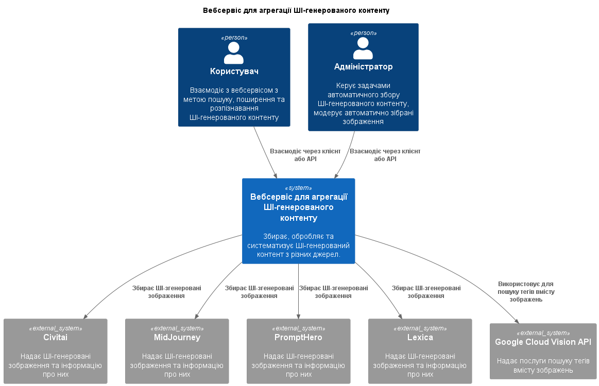
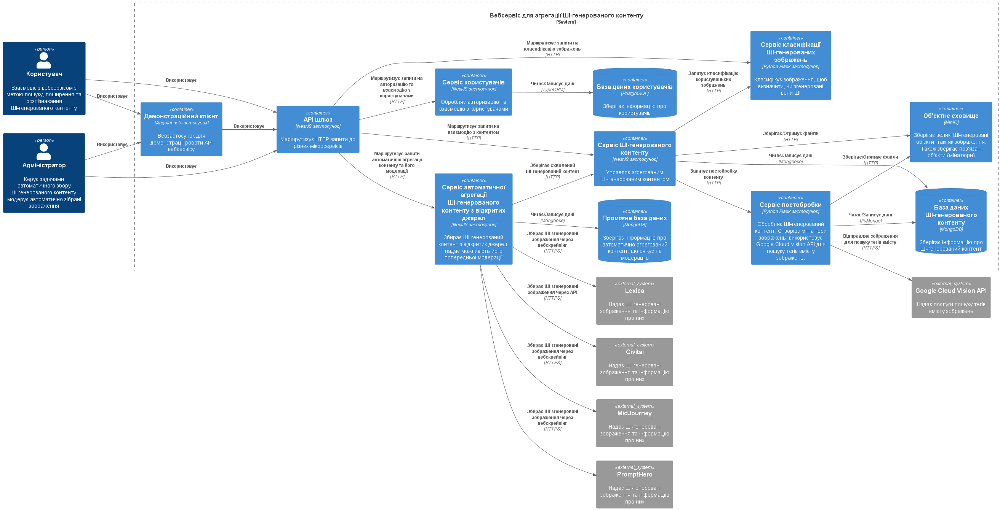

# AI-ggregate: Web Service for Aggregating AI-Generated Content

This repository contains the diploma project for the bachelor's degree in Software Engineering at the National Technical University of Ukraine "Igor Sikorsky Kyiv Polytechnic Institute". The goal of the project is to develop a web service for aggregating AI-generated content, primarily focusing on AI-generated images. The system facilitates the search, recognition, and aggregation of such content from both open sources and user contributions.

## Table of Contents
- [About the Project](#about-the-project)
- [Features](#features)
- [Technologies Used](#technologies-used)
- [C4 Diagrams](#c4-diagrams)
- [Installation](#installation)
- [Usage](#usage)

## About the Project
The **AI-ggregate** web service is developed to address the growing need for a centralized service to handle AI-generated content. The platform aggregates AI-generated images from open sources, allows users to upload their own AI-generated content, and enables users to search and classify AI-generated images. It is particularly useful for developers, researchers in AI, and general users interested in generative AI content.

The main objectives of the project include:
- Simplifying the process of searching for and recognizing AI-generated images.
- Aggregating AI-generated content from open sources and user uploads.
- Providing a service for the classification of AI-generated images.

## Features
- **User authentication**: Secure login and registration for users.
- **AI-generated image search**: Search aggregated AI-generated images from open sources.
- **Content aggregation**: Automatically aggregate AI-generated images from multiple open sources.
- **User uploads**: Allow users to upload their own AI-generated images for classification and storage.
- **AI-generated image recognition**: Classify images to determine if they were generated by AI.
- **Admin moderation**: Admins can manage and moderate aggregated content.

## Technologies Used
The project utilizes the following technologies:
- **Languages**: TypeScript, Python
- **Frontend**: Angular
- **Backend**: NestJS, Flask
- **AI Library**: FastAI
- **Database**: PostgreSQL
- **Containerization**: Docker
- **AI Models**: ResNet (for image classification)

## C4 Diagrams

### 1. Context Diagram
This diagram shows the system and its external actors, including users, admins, and external data sources.



### 2. Container Diagram
The high-level architecture of the platform, including the web UI, API services, and database.




## Installation

Follow these steps to install and run the project locally:

1. Clone the repository:
   ```bash
   git clone https://github.com/Ekedani/diploma-project.git
   ```
2. Install backend dependencies:
   ```bash
   pip install -r requirements.txt
   ```
3. Install frontend dependencies:
   ```bash
   npm install
   ```
4. Set up environment variables:
   ```bash
   cp .env.example .env
   ```
   Configure the `.env` file with appropriate API keys, database credentials, and other settings.

5. Start the Docker container:
   ```bash
   docker-compose up --build
   ```

## Usage

To run the application, use the following commands:

- To start the backend server:
   ```bash
   python manage.py runserver
   ```

- To start the frontend application:
   ```bash
   npm start
   ```
